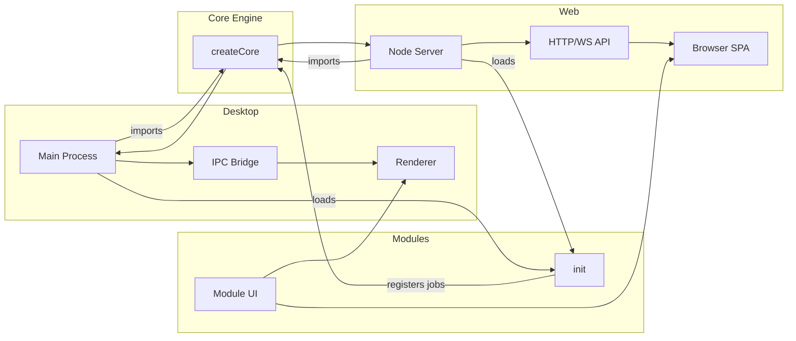
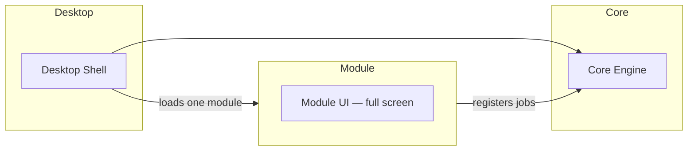
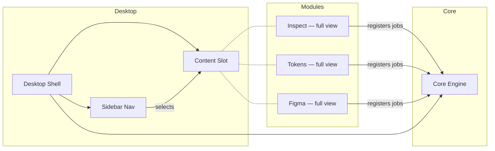
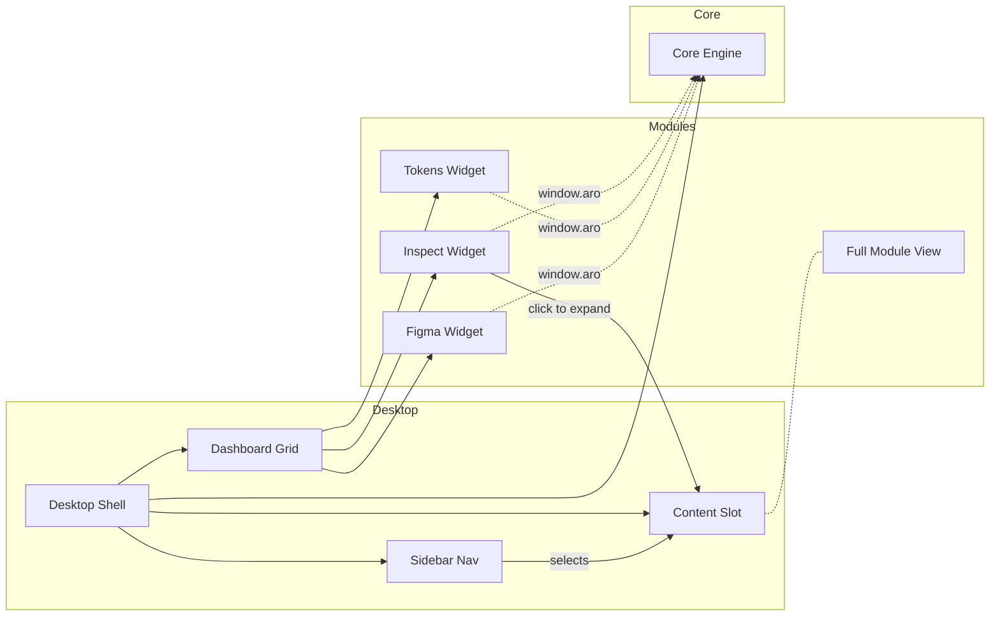
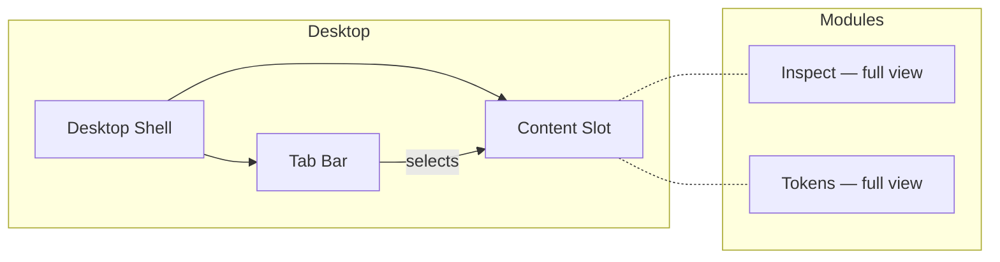
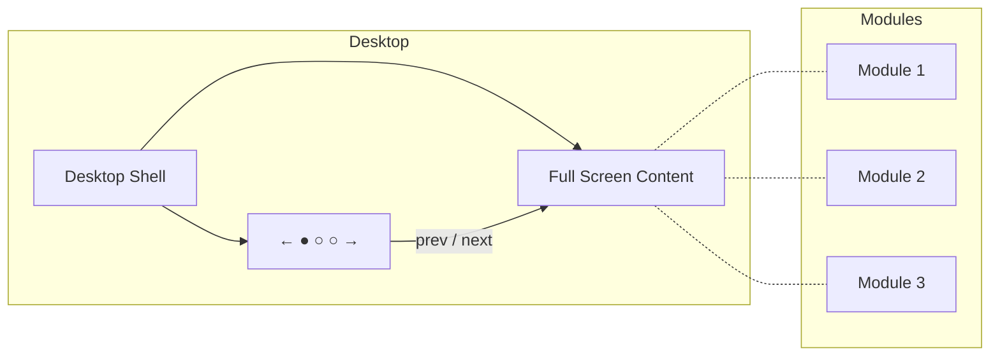

# aro-studio-apps-dev

Design-system application suite: Core (headless engine), Desktop (Electron host), Web (browser host), and Modules (feature modules). Built as a single repo with clear layering and dependency rules. Desktop, Web, and module MVPs are complete.

## Key Concepts

| Concept | What it is | Analogy |
|---------|-----------|---------|
| **Core** | The headless engine shared by all hosts. Manages workspaces, jobs, runs, logs, and artifacts. Contains no UI. | The engine of a car — same engine, different body styles. |
| **Desktop** | An Electron host that runs Core and renders modules in a native app window. | The car body — wraps the engine for desktop use. |
| **Web** | A browser + Node server host that runs Core and renders the same modules in a browser tab. | A different body on the same engine — for browser use. |
| **Module** | A self-contained feature that registers jobs with Core and provides a full-screen React UI. Modules are pluggable and host-agnostic. | An app on your phone — self-contained, focused on one task. |
| **Widget** | An optional compact view a module can provide for the Dashboard. Shows a summary with basic interactivity. Shares the same API as the full module. | A phone home-screen widget — a glanceable preview of the full app. |

### UI Models

The framework supports five ways to present modules. Set `ARO_UI_MODEL` in `.env` to choose.

| Model | What the user sees | When to use |
|-------|-------------------|-------------|
| **Standalone** | One module, full screen. No navigation chrome. | Single-purpose products (e.g. "Aro Inspect", "Aro Tokens"). |
| **Sidebar** | A vertical sidebar to switch between modules. One module visible at a time. | Multi-feature product where users move between tools. |
| **Dashboard** | A grid of widget cards showing all modules at a glance. Click a card to open the full module view. | Overview-first products where users need to see multiple summaries simultaneously. |
| **Tabs** | A horizontal tab bar to switch between modules. One module visible at a time. | Compact multi-feature products where horizontal space is preferred over a sidebar. |
| **Carousel** | A swipeable full-screen view with prev/next navigation. One module visible at a time. | Guided or sequential experiences where users step through modules in order. |

All five models use the same Core, the same modules, and the same API. Only the shell layout changes.

## How it works

Aro Studio is a modular application with a shared Core engine and pluggable Modules. Two hosts can run the same Core and Modules: **Desktop** (Electron) and **Web** (browser + Node backend).



**What the application offers:**

- **Core engine** — workspace management, jobs, runs, logs, artifacts, validation
- **Hosts** (Desktop or Web) — load Core, initialize the active module, expose the same intent-based API to the UI
- **Modules** — register jobs with Core, provide React UI in the host renderer
- **User capabilities** — workspace selection, job execution, live logs, artifacts (same whether you use Desktop or Web)

**Desktop vs Web — when to use which:**

- **Desktop:** Native Electron app with system integration, native workspace folder picker, and full OS integration. Run `pnpm desktop` (or `pnpm start`). Best for local development and installed-app workflows.
- **Web:** Browser-based UI with a Node backend. Run `pnpm web`. Best for testing in Cursor’s browser, running without Electron, or using the same modules in a browser. Same Core and modules; choose the host that fits your workflow.

Detail: [diagrams/application-flow.md](diagrams/application-flow.md) | [diagrams/desktop-flow.md](diagrams/desktop-flow.md) | [diagrams/web-app-flow.md](diagrams/web-app-flow.md)

## Status

- **Desktop MVP:** Complete — workspace selection, jobs, runs, logs, artifacts, IPC, module loading. See [docs/desktop/DESKTOP_MVP_CHECKLIST.md](docs/desktop/DESKTOP_MVP_CHECKLIST.md).
- **Module MVP:** hello-world and inspect modules — job registration, UI, logs and artifacts; no module-to-module imports or direct DB/filesystem access. See [docs/modules/MODULE_MVP_CHECKLIST.md](docs/modules/MODULE_MVP_CHECKLIST.md). Inspect: design-system diagnostic (tokens, components, health report); see [docs/modules/inspect/Design-spec.md](docs/modules/inspect/Design-spec.md).
- **Web MVP:** Complete — browser UI + Node API; workspace from env, jobs, runs, logs, artifacts, WebSocket; same Core and modules as Desktop. See [docs/web/WEB_MVP_CHECKLIST.md](docs/web/WEB_MVP_CHECKLIST.md).
- **Tenant configuration:** Structured config system (`@aro/config`) with Zod validation, optional `tenant.config.json`, and `.env` overrides. Covers UI model, enabled modules, brand identity, theme tokens, and feature flags. See [docs/architecture/TENANT_CONFIGURATION.md](docs/architecture/TENANT_CONFIGURATION.md).
- **CI & quality gates:** GitHub Actions CI (lint, build, test on every PR). Pre-commit hook via husky + lint-staged runs ESLint on staged files. IPC/API payloads validated with Zod schemas at the boundary.
- **Stack:** Core (Node, SQLite, Zod); Desktop (Electron, React, TypeScript, shadcn + Tailwind); Modules (React; use `@aro/ui/components` for the shared design system).

## Run / build

**Root scripts** (from `package.json`):

| Script | Command | What it does |
|--------|---------|--------------|
| `build` | `pnpm build` | Build all packages (Core, Desktop, Web). Run before production. |
| `test` | `pnpm test` | Run all tests (Core contract tests + Inspect determinism tests). |
| `lint` | `pnpm lint` | Run ESLint across the entire monorepo. Enforces architectural boundary rules. |
| `desktop` | `pnpm desktop` | Launch the **Desktop** (Electron) app with workspace picker, jobs, logs, artifacts. |
| `start` | `pnpm start` | Same as `desktop` — launches the Desktop app. |
| `web` | `pnpm web` | Start the **Web** app. Runs a dev orchestrator: cleans up its own prior run if any, starts API (3001), waits for readiness, then starts Vite (port 5173). Open http://localhost:5173 in the browser. |
| `reset-db` | `pnpm reset-db [workspace-path]` | **Dev only.** Reset the workspace SQLite database to a clean baseline. Deletes all rows from `runs`, `logs`, `artifacts` tables; removes artifact files from disk; runs VACUUM. Accepts an optional workspace path argument (defaults to `ARO_WORKSPACE_ROOT` or cwd). Idempotent and safe to run multiple times. |
| `prepare` | `pnpm prepare` | Runs automatically after `pnpm install`. Initializes husky git hooks so the pre-commit hook (lint-staged) is wired into `.git/hooks/`. |

**Before first run:** `pnpm install` to install dependencies.

**Per-package (advanced):** `pnpm --filter @aro/core build|test`, `pnpm --filter @aro/desktop build|dev|start`, `pnpm --filter @aro/web run dev:server` (API only; for full Web dev use `pnpm web`). Use when iterating on a single package.

```bash
pnpm install
pnpm build
pnpm test
pnpm desktop   # or pnpm start — Launch Desktop app
pnpm web       # Launch Web app — API on 3001, Vite on 5173 (open http://localhost:5173)
```

If `pnpm web` fails with `EADDRINUSE: port 3001`, an unrelated process owns the port. The orchestrator only cleans up its own prior runs; stop the other process or use a different port.

**Configure modules:** Set `ARO_UI_MODEL` and `ARO_ENABLED_MODULES` in a `.env` file at the project root. Both Desktop and Web load `.env` at startup. Valid module IDs: **`hello-world`** and **`inspect`**.

- **`.env` for development:** Set `ARO_UI_MODEL=standalone` and `ARO_ENABLED_MODULES=inspect`, then restart the app. No rebuild needed. Shell/inline env vars override `.env` if both are set.
- **`tenant.config.json` (optional):** A structured JSON config file at the project root. Env vars in `.env` always override it. See [docs/architecture/TENANT_CONFIGURATION.md](docs/architecture/TENANT_CONFIGURATION.md) for the full config system (brand, theme tokens, feature flags).
- **Env example file:** Copy `.env.example` to `.env` and edit as needed: `cp .env.example .env`

See [docs/desktop/ACTIVE_MODULE_SWITCH.md](docs/desktop/ACTIVE_MODULE_SWITCH.md) for full details.

## Module models

The architecture supports five module integration models. Pick the one that fits your use case — all share the same module contract.

### Standalone Model (current)

One module per app. The module owns the entire UI. Think of each build as a separate product: "Aro Studio Inspect", "Aro Studio Tokens".



**Config:** `ARO_UI_MODEL=standalone` + `ARO_ENABLED_MODULES=inspect`

---

### Sidebar Model

One app, multiple modules. A sidebar lets you switch between full module views. All enabled modules are loaded; one is visible at a time.



**Config:** `ARO_UI_MODEL=sidebar` + `ARO_ENABLED_MODULES=inspect,tokens,figma`

---

### Dashboard Model

One app, multiple modules visible simultaneously. A tiled grid of module widgets shows key metrics at a glance. Click a tile to open the full view (falls back to sidebar navigation).



**Config:** `ARO_UI_MODEL=dashboard` + `ARO_ENABLED_MODULES=inspect,tokens,figma`

---

### Tabs Model

A horizontal tab bar instead of a vertical sidebar. Each tab shows one module's full view. Lighter weight; best for 2–4 modules.



**Config:** `ARO_UI_MODEL=tabs` + `ARO_ENABLED_MODULES=inspect,tokens`

---

### Carousel Model

No persistent navigation. One module fills the screen. Left/right arrows and dot indicators at the bottom. Mobile and presentation friendly.



**Config:** `ARO_UI_MODEL=carousel` + `ARO_ENABLED_MODULES=inspect,tokens,figma`

---

### Choosing a model

| | Standalone | Sidebar | Dashboard | Tabs | Carousel |
|---|---|---|---|---|---|
| Best for | Single-purpose apps | Multi-feature product | Overview + deep-dive | 2–4 modules, browser-like | Demos, mobile, kiosk |
| Modules visible | 1 | 1 (switch via sidebar) | Many (tiles) + 1 (full) | 1 (switch via tabs) | 1 (swipe / arrows) |
| Complexity | Low | Medium | High | Low | Low |
| Config | `standalone` | `sidebar` | `dashboard` | `tabs` | `carousel` |

Core and the module contract remain the same across all models. Both Desktop and Web support all five — only the shell layout changes.

Full detail: [docs/modules/MODULE_MODELS.md](docs/modules/MODULE_MODELS.md) | [docs/modules/MODULE_TRANSITION.md](docs/modules/MODULE_TRANSITION.md) | [diagrams/module-models.md](diagrams/module-models.md)

## Testing

Core tests run under Electron’s Node (better-sqlite3 ABI); see the test script in `packages/core`. **Web** runs the API server under Electron's Node so it uses the same better-sqlite3 build as Desktop. If you see "Could not locate the bindings file" or `NODE_MODULE_VERSION` errors, run `pnpm rebuild better-sqlite3` or `pnpm --filter @aro/desktop exec electron-rebuild` as needed.

## Agents

Agent roles and execution order: [.claude/governance/agents.md](.claude/governance/agents.md). AI control plane: [.claude/](.claude/).

## Documentation

Documentation lives in this repo:

- **Architecture and API:** [docs/ARCHITECTURE.md](docs/ARCHITECTURE.md), [docs/core/CORE_PUBLIC_API.md](docs/core/CORE_PUBLIC_API.md). See [docs/README.md](docs/README.md) for the full index by layer (core/, desktop/, web/, modules/, meta/).
- **Tenant configuration:** [docs/architecture/TENANT_CONFIGURATION.md](docs/architecture/TENANT_CONFIGURATION.md) — config resolution, schema reference, brand, theme, feature flags.
- **White-label architecture:** [docs/architecture/WHITE_LABEL.md](docs/architecture/WHITE_LABEL.md) — design principles and roadmap for the white-label system.
- **Checklists:** [docs/desktop/DESKTOP_MVP_CHECKLIST.md](docs/desktop/DESKTOP_MVP_CHECKLIST.md), [docs/modules/MODULE_MVP_CHECKLIST.md](docs/modules/MODULE_MVP_CHECKLIST.md).
- **UI/UX and a11y:** [docs/meta/UI_UX_ACCESSIBILITY.md](docs/meta/UI_UX_ACCESSIBILITY.md).
- **Agent roles and execution order:** [.claude/governance/agents.md](.claude/governance/agents.md).
- **Cursor rules:** [.cursor/rules/](.cursor/rules/) (e.g. CURSOR_RULES.md, README.md).
- **ADRs, decisions, diagrams:** [adr/](adr/), [decisions/](decisions/), [diagrams/](diagrams/).

**Before coding:** Read [.cursor/rules/README.md](.cursor/rules/README.md), then follow [docs/ARCHITECTURE.md](docs/ARCHITECTURE.md) and [docs/core/CORE_PUBLIC_API.md](docs/core/CORE_PUBLIC_API.md).
