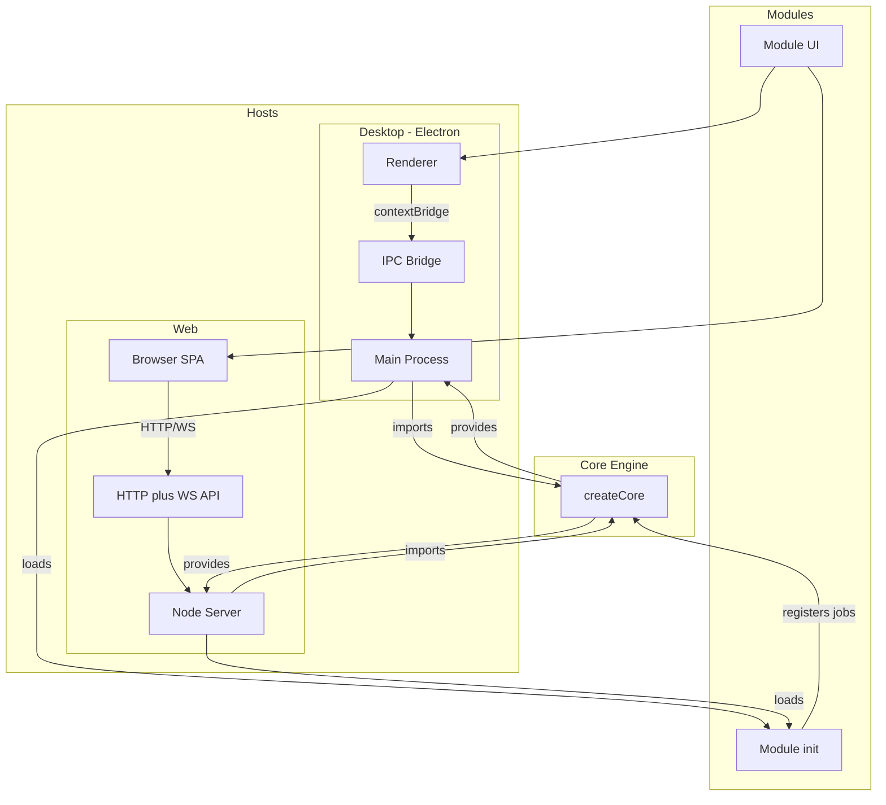

# aro-studio-apps-dev

Design-system application suite: Core (headless engine), Desktop (Electron host), Web (browser host), and Modules (feature modules). Built as a single repo with clear layering and dependency rules. Desktop and hello-world module MVPs are complete; Web MVP is in progress.

## How it works

Aro Studio is a modular application with a shared Core engine and pluggable Modules. Two hosts can run the same Core and Modules: **Desktop** (Electron) and **Web** (browser + Node backend).



**What the application offers:** A headless Core engine handles workspace management, jobs, runs, logs, artifacts, and validation. Hosts (Desktop or Web) load Core, initialize the active module, and expose the same intent-based API to the UI. Modules register jobs with Core and provide React UI that runs in the host’s renderer. You get workspace selection, job execution, live logs, and artifacts — same capabilities whether you use Desktop or Web.

**Desktop vs Web — when to use which:**

- **Desktop:** Native Electron app with system integration, native workspace folder picker, and full OS integration. Run `pnpm desktop` (or `pnpm start`). Best for local development and installed-app workflows.
- **Web:** Browser-based UI with a Node backend. Run `pnpm web`. Best for testing in Cursor’s browser, running without Electron, or using the same modules in a browser. Same Core and modules; choose the host that fits your workflow.

Detail: [diagrams/application-flow.md](diagrams/application-flow.md) | [diagrams/desktop-flow.md](diagrams/desktop-flow.md) | [diagrams/web-app-flow.md](diagrams/web-app-flow.md)

## Status

- **Desktop MVP:** Complete — workspace selection, jobs, runs, logs, artifacts, IPC, module loading. See [docs/desktop/DESKTOP_MVP_CHECKLIST.md](docs/desktop/DESKTOP_MVP_CHECKLIST.md).
- **Module MVP:** hello-world and inspect modules — job registration, UI, logs and artifacts; no module-to-module imports or direct DB/filesystem access. See [docs/modules/MODULE_MVP_CHECKLIST.md](docs/modules/MODULE_MVP_CHECKLIST.md). Inspect: design-system diagnostic (tokens, components, health report); see [docs/modules/inspect/Design-spec.md](docs/modules/inspect/Design-spec.md).
- **Web MVP:** In progress — browser UI + Node API; same Core and modules as Desktop. See [docs/web/WEB_MVP_CHECKLIST.md](docs/web/WEB_MVP_CHECKLIST.md).
- **Stack:** Core (Node, SQLite, Zod); Desktop (Electron, React, TypeScript, shadcn + Tailwind); Modules (React; use `@aro/desktop/components` for the shared design system).

## Run / build

**Root scripts** (from `package.json`):

| Script | Command | What it does |
|--------|---------|--------------|
| `build` | `pnpm build` | Build all packages (Core, Desktop, Web). Run before production. |
| `test` | `pnpm test` | Run Core tests. |
| `desktop` | `pnpm desktop` | Launch the **Desktop** (Electron) app with workspace picker, jobs, logs, artifacts. |
| `start` | `pnpm start` | Same as `desktop` — launches the Desktop app. |
| `web` | `pnpm web` | Start the **Web** app. Runs a dev orchestrator: cleans up its own prior run if any, starts API (3001), waits for readiness, then starts Vite (port 5173). Open http://localhost:5173 in the browser. |

**Before first run:** `pnpm install` to install dependencies.

**Per-package (advanced):** `pnpm --filter @aro/core build|test`, `pnpm --filter @aro/desktop build|dev|start`, `pnpm --filter @aro/web run dev:server` (API only; for full Web dev use `pnpm web`). Use when iterating on a single package.

```bash
pnpm install
pnpm build
pnpm test
pnpm desktop   # or pnpm start — Launch Desktop app
pnpm web       # Launch Web app — API on 3001, Vite on 5173 (open http://localhost:5173)
```

If `pnpm web` fails with `EADDRINUSE: port 3001`, an unrelated process owns the port. The orchestrator only cleans up its own prior runs; stop the other process or use a different port.

**Switch active module:** When `ARO_ACTIVE_MODULE` is not set, the app loads **hello-world** (default). Valid module IDs: **`hello-world`** (default) and **`inspect`**. The **inspect** module is currently **in QA** (not yet production-ready).

- **.env for development:** Set the active module in a `.env` file so you don't need to pass the env var each time. The Desktop app loads **`.env` at the project root** at startup (when present). Set `ARO_ACTIVE_MODULE=hello-world` or `ARO_ACTIVE_MODULE=inspect`, then restart the app. No rebuild. Shell/inline env var overrides `.env` if both are set.
- **Env example file:** A template lives at **`.env.example`** at the project root. It contains `ARO_ACTIVE_MODULE=hello-world`. Copy it to `.env` and edit as needed: `cp .env.example .env`

See [docs/desktop/ACTIVE_MODULE_SWITCH.md](docs/desktop/ACTIVE_MODULE_SWITCH.md) for full details (inline/shell, adding new modules).

## Testing

Core tests run under Electron’s Node (better-sqlite3 ABI); see the test script in `packages/core`. **Web** runs the API server under Electron's Node so it uses the same better-sqlite3 build as Desktop. If you see "Could not locate the bindings file" or `NODE_MODULE_VERSION` errors, run `pnpm rebuild better-sqlite3` or `pnpm --filter @aro/desktop exec electron-rebuild` as needed.

## Agents

Agent roles and execution order: [AGENTS.md](AGENTS.md).

## Documentation

Documentation lives in this repo:

- **Architecture and API:** [docs/ARCHITECTURE.md](docs/ARCHITECTURE.md), [docs/core/CORE_PUBLIC_API.md](docs/core/CORE_PUBLIC_API.md). See [docs/README.md](docs/README.md) for the full index by layer (core/, desktop/, web/, modules/, meta/).
- **Checklists:** [docs/desktop/DESKTOP_MVP_CHECKLIST.md](docs/desktop/DESKTOP_MVP_CHECKLIST.md), [docs/modules/MODULE_MVP_CHECKLIST.md](docs/modules/MODULE_MVP_CHECKLIST.md).
- **UI/UX and a11y:** [docs/meta/UI_UX_ACCESSIBILITY.md](docs/meta/UI_UX_ACCESSIBILITY.md).
- **Agent roles and execution order:** [AGENTS.md](AGENTS.md).
- **Cursor rules:** [.cursor/rules/](.cursor/rules/) (e.g. CURSOR_RULES.md, README.md).
- **ADRs, decisions, diagrams:** [adr/](adr/), [decisions/](decisions/), [diagrams/](diagrams/).

**Before coding:** Read [.cursor/rules/README.md](.cursor/rules/README.md), then follow [docs/ARCHITECTURE.md](docs/ARCHITECTURE.md) and [docs/core/CORE_PUBLIC_API.md](docs/core/CORE_PUBLIC_API.md).
