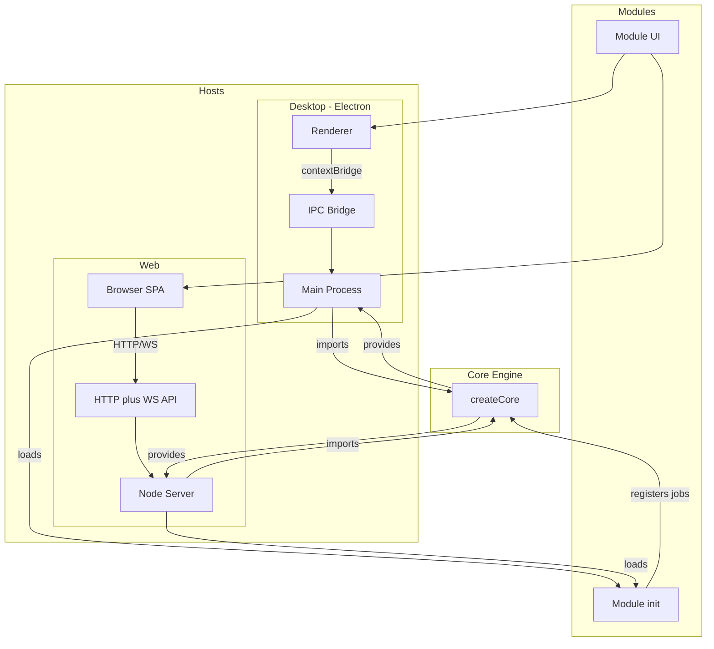

# Application flow (holistic)

How Core, Desktop, Web, and Modules fit together.

```mermaid
flowchart TB
    subgraph Hosts [Hosts]
        subgraph Desktop [Desktop - Electron]
            DesktopMain[Main Process]
            DesktopRenderer[Renderer]
            DesktopIPC[IPC Bridge]
        end
        subgraph Web [Web]
            WebBackend[Node Server]
            WebFrontend[Browser SPA]
            WebAPI[HTTP plus WS API]
        end
    end

    subgraph Engine [Core Engine]
        Core[createCore]
    end

    subgraph Modules [Modules]
        ModuleInit[Module init]
        ModuleUI[Module UI]
    end

    DesktopMain -->|imports| Core
    DesktopMain -->|loads| ModuleInit
    DesktopRenderer -->|contextBridge| DesktopIPC
    DesktopIPC --> DesktopMain
    ModuleUI --> DesktopRenderer

    WebBackend -->|imports| Core
    WebBackend -->|loads| ModuleInit
    WebFrontend -->|HTTP/WS| WebAPI
    WebAPI --> WebBackend
    ModuleUI --> WebFrontend

    ModuleInit -->|registers jobs| Core
    Core -->|provides| DesktopMain
    Core -->|provides| WebBackend
```
