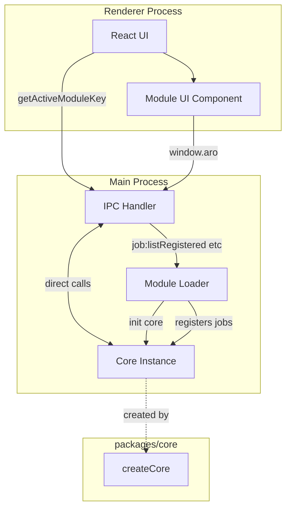

# Desktop / Electron app flow

Individual flow for the Desktop (Electron) host.

```mermaid
flowchart TB
    subgraph Renderer [Renderer Process]
        UI[React UI]
        ModuleComponent[Module UI Component]
    end

    subgraph Main [Main Process]
        IPC[IPC Handler]
        CoreInstance[Core Instance]
        ModuleLoader[Module Loader]
    end

    subgraph CorePkg [packages/core]
        createCore[createCore]
    end

    UI -->|getActiveModuleKey| IPC
    UI --> ModuleComponent
    ModuleComponent -->|window.aro| IPC
    IPC <-->|direct calls| CoreInstance
    CoreInstance -.->|created by| createCore
    ModuleLoader -->|init core| CoreInstance
    ModuleLoader -->|registers jobs| CoreInstance
    IPC -->|job:listRegistered etc| ModuleLoader
```
