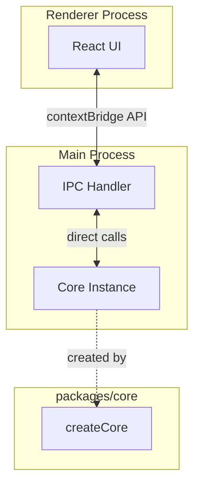

# Desktop MVP

```mermaid
flowchart TB
    subgraph Renderer [Renderer Process]
        UI[React UI]
    end

    subgraph Main [Main Process]
        IPC[IPC Handler]
        CoreInstance[Core Instance]
    end

    subgraph CorePkg [packages/core]
        createCore[createCore]
    end

    UI <-->|"contextBridge API"| IPC
    IPC <-->|"direct calls"| CoreInstance
    CoreInstance -.->|"created by"| createCore
```
