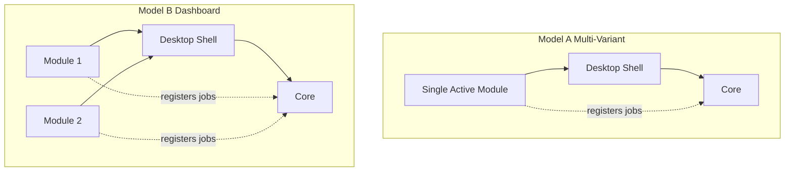

# Module Models Diagram

```mermaid
flowchart TB
  subgraph ModelA [Model A Multi-Variant]
    DesktopA[Desktop Shell]
    ModuleA[Single Active Module]
    CoreA[Core]
    DesktopA --> CoreA
    ModuleA --> DesktopA
    ModuleA -.->|registers jobs| CoreA
  end

  subgraph ModelB [Model B Dashboard]
    DesktopB[Desktop Shell]
    Module1[Module 1]
    Module2[Module 2]
    CoreB[Core]
    DesktopB --> CoreB
    Module1 --> DesktopB
    Module2 --> DesktopB
    Module1 -.->|registers jobs| CoreB
    Module2 -.->|registers jobs| CoreB
  end
```

Reference from [docs/modules/MODULE_KICK_OFF.md](../docs/modules/MODULE_KICK_OFF.md) and [docs/modules/MODULE_MODELS.md](../docs/modules/MODULE_MODELS.md).
