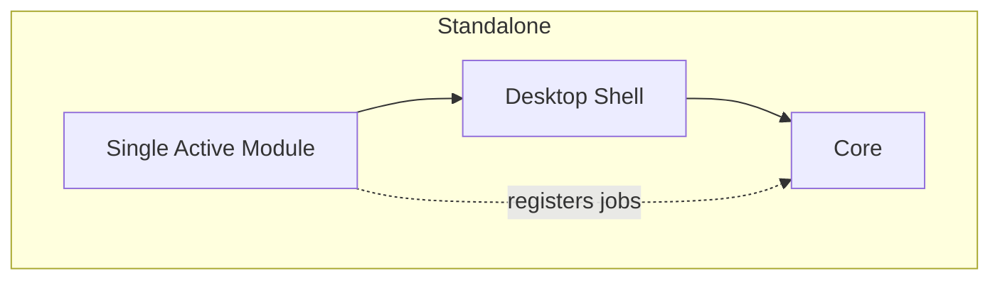
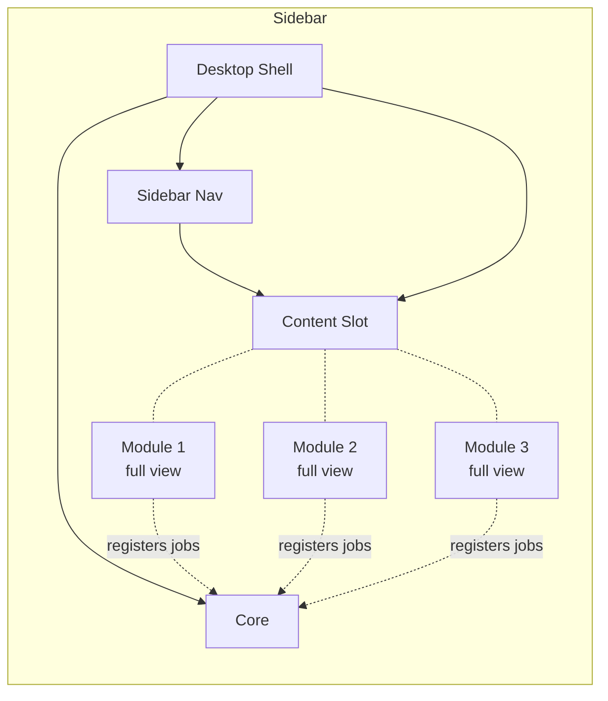
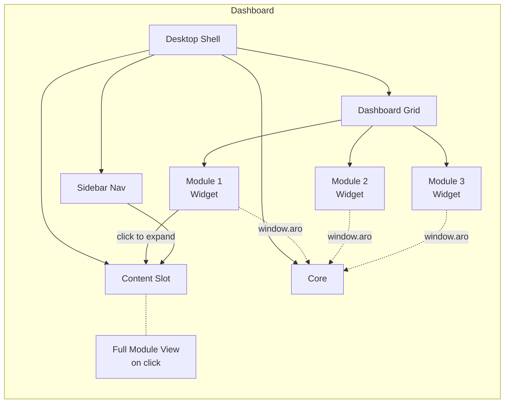
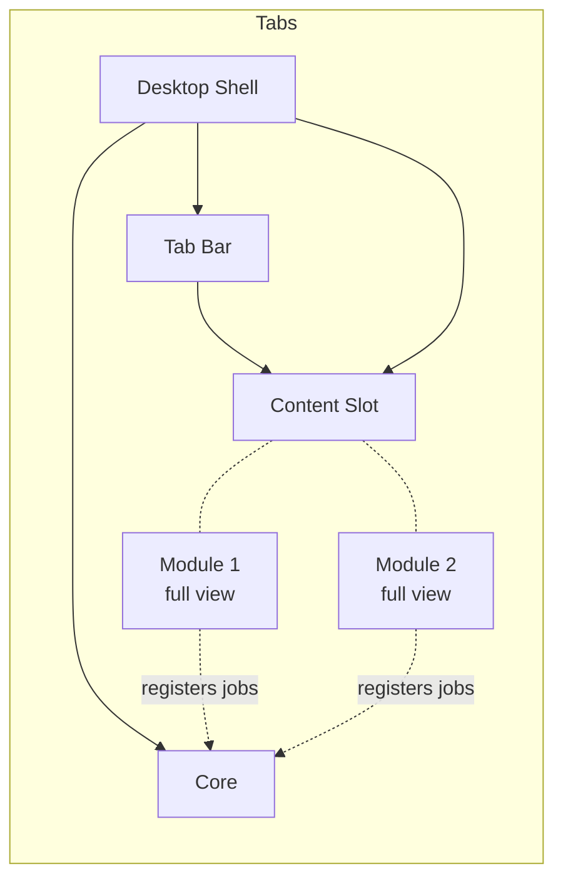
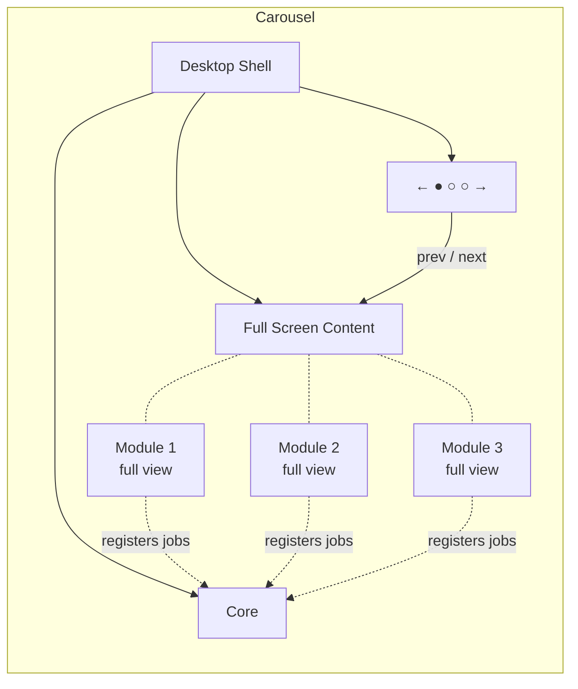
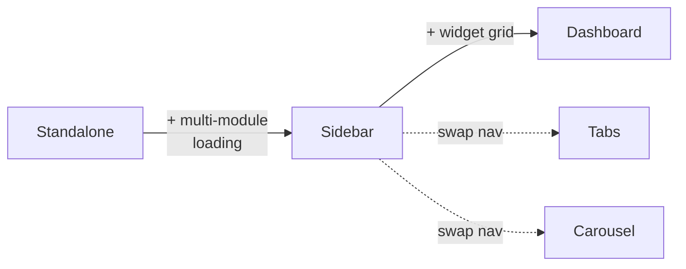

# Module Models Diagram

## Standalone Model

One module per app. Module owns the renderer content.

## Sidebar Model

One app, multiple modules. Sidebar switches between full module views.

## Dashboard Model

One app, multiple modules visible simultaneously as tiles. Sidebar still available for full views.

## Tabs Model

Horizontal tab bar. One module visible at a time. Best for 2–4 modules.

## Carousel Model

Arrow/dot navigation. One module fills the screen. No persistent nav chrome.

## Model Relationships

Reference: [docs/modules/MODULE_MODELS.md](../docs/modules/MODULE_MODELS.md) and [docs/modules/MODULE_TRANSITION.md](../docs/modules/MODULE_TRANSITION.md).
