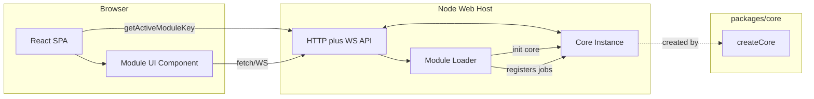

# Web app flow

Individual flow for the Web host (browser + Node backend).

```mermaid
flowchart LR
    subgraph Browser [Browser]
        WebUI[React SPA]
        ModuleComponent[Module UI Component]
    end

    subgraph NodeHost [Node Web Host]
        API[HTTP plus WS API]
        CoreInstance[Core Instance]
        ModuleLoader[Module Loader]
    end

    subgraph CorePkg [packages/core]
        createCore[createCore]
    end

    WebUI -->|getActiveModuleKey| API
    WebUI --> ModuleComponent
    ModuleComponent -->|fetch/WS| API
    API <--> CoreInstance
    API --> ModuleLoader
    ModuleLoader -->|init core| CoreInstance
    ModuleLoader -->|registers jobs| CoreInstance
    CoreInstance -.->|created by| createCore
```
